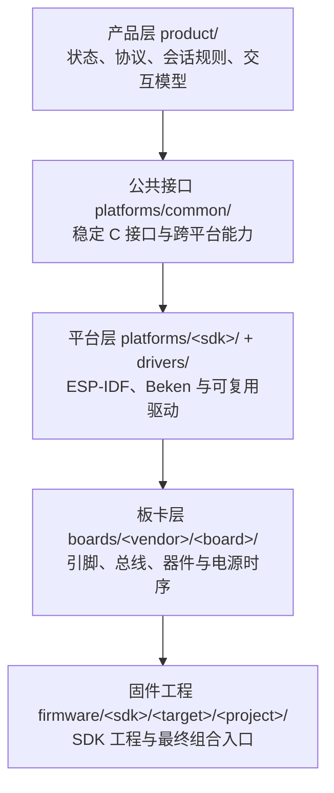
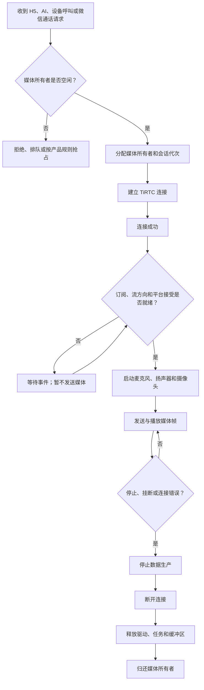
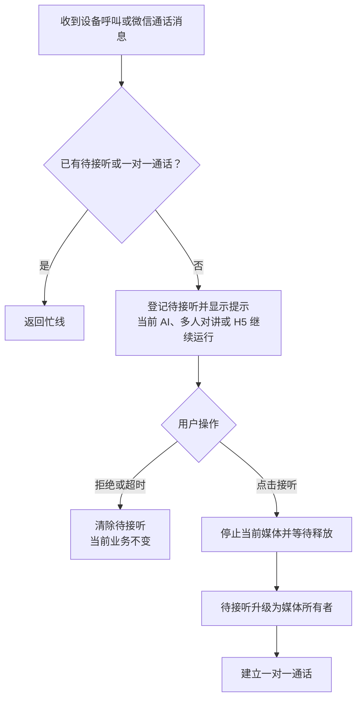

# 小钛架构与二次开发

[快速体验](README.md) · [架构与二次开发](ARCHITECTURE.md) · [参与开发](CONTRIBUTING.md) · [完整文档](docs/README.md)

这份文档说明小钛怎样把同一套产品能力部署到不同芯片和开发板。它既是工程师理解代码的入口，也是 AI 开发工具修改项目前需要读取的背景资料。

## 产品能力

小钛目前支持 H5（网页端）实时查看与双向对讲、AI（人工智能）语音对话、设备呼叫和微信网络通话。

产品层还负责配网、绑定、联系人、房间、按键、触摸界面和会话状态。板卡是否有屏幕、摄像头或完整交互界面，由其 variant（功能变体）明确选择，不能由代码根据芯片名称猜测。

## 分层方式

先看各层怎样衔接，再分别理解它们的职责。箭头表示产品能力从公共逻辑落到具体固件的组合方向。

`product/` 决定产品当前处于什么状态、下一步允许做什么。它不直接控制 GPIO（通用输入输出引脚）、DMA（直接存储器访问）或具体音频设备。

`platforms/` 把产品需要的稳定 C 接口映射到芯片 SDK（软件开发工具包）。网络、线程、内存和媒体收发在这里形成边界，板卡专属引脚仍留在板级代码。

`boards/` 描述一块确定的硬件。相同芯片的两块开发板也必须分别登记，因为屏幕、触摸、音频、电源时序和烧录布局可能不同。

`firmware/` 是组合入口。ESP-IDF 与 Beken 保持为独立 SDK 工程；根目录 `tools/build.py` 只选择一块板和一个变体，然后转调原生构建命令。

新增板卡或平台时，目录依赖和板卡清单仍遵守本页分层，并按[参与开发](CONTRIBUTING.md)
中的接入流程补齐资料、测试和实板证据。

## 目录导览

根目录只保留跨平台入口和对外文档。芯片 SDK（软件开发工具包）工程继续保持独立，
公共产品逻辑通过稳定 C 接口下沉，避免为了复用而把不同厂商的工程强行合并。

| 目录或文件 | 作用 |
|---|---|
| `README.md` | 下载固件、匹配开发板、烧录和快速体验 |
| `ARCHITECTURE.md` | 产品架构、目录边界和二次开发入口 |
| `product/` | 会话仲裁、联系人、房间、交互状态等公共业务逻辑 |
| `platforms/` | ESP-IDF、Beken 等平台适配和公共 C 接口 |
| `drivers/` | 可跨板复用、但不拥有产品状态的器件驱动 |
| `boards/` | 板卡清单、硬件配置和构建选择信息 |
| `firmware/` | 各芯片平台独立的原生固件工程与组合入口 |
| `tools/` | 构建、打包、校验和自动化测试入口 |
| `tests/` | 主机测试、契约测试和测试辅助程序 |
| `docs/` | 对外产品、开发、板卡、编译和烧录文档 |

项目还约定了三个只在本机使用的目录。`.tools/` 放编译器、厂商 SDK 和 Python
环境；`.references/` 放原理图、数据手册、厂商示例和参考 SDK；`output/` 放本次
构建生成的固件与验证包。它们已由 `.gitignore` 忽略，不随仓库提交，也不能成为
源码的隐式依赖。

仓库文档只记录这些工具和资料的公开获取地址、版本与 SHA-256（文件校验值）。
硬件资料链接应指向开发板提供者或器件厂商的官方来源；没有已知地址时，链接栏留空，
可在资料状态栏注明“未提供”，不猜测地址、不写本机文件路径。
原理图、手册及厂商示例的下载副本仅供本地开发联调，放入 `.references/`，
不在 `evidence/` 或其他受版本控制的目录重复保存。项目自己的硬件结论和实板
验证记录仍保留在板卡文档及 Hardware IR 中，并引用第三方来源。

## 会话与媒体生命周期

设备同一时间只有一个媒体所有者。H5、AI、设备呼叫和微信网络通话不能绕过产品运行时，各自直接抢占麦克风、扬声器或 TiRTC 连接。

下图覆盖一次会话从请求到释放的完整过程。媒体就绪是独立步骤，不能在连接回调成功后直接跳过。

“连接成功”不等于“上行已经可发送”。代码必须区分传输连接、平台接受、媒体订阅和实际首帧。每次回调还要核对会话代次，避免旧连接在新会话中释放资源。

错误的 stream ID（媒体流编号）、未上报的设备能力或过早发送数据，都可能造成单向无声。释放顺序错误则可能造成任务异常退出或访问已经回收的缓冲区。

## 业务进入与会话优先级

业务优先级不能只写成一条高低顺序，因为“收到呼叫消息”和“用户接听后占用媒体”是两个不同阶段。下面的规则由产品运行时统一执行，界面和平台适配器不能自行绕过。

| 场景 | 收到请求时 | 用户确认后或允许进入时 |
|---|---|---|
| H5 实时查看 | 仅媒体空闲且未处于多人对讲时接受 | 取得媒体所有权；AI、多人对讲或一对一通话期间拒绝进入 |
| AI 对话 | 由按键、触摸或唤醒等明确意图发起 | 结束可被替代的低优先级业务，再取得媒体所有权 |
| 多人对讲 | 由用户进入房间或按产品规则恢复 | 占用媒体期间拒绝 H5；被更高优先级业务挂起后，按房间期望状态恢复 |
| 设备呼叫或微信通话 | 只登记一条待接听并显示提示，不立即停止当前业务 | 用户点击接听后，按顺序停止当前媒体、释放资源，再进入一对一通话 |

一对一设备呼叫和微信通话共用一个先到先得的待接听槽。已有待接听或正在进行的一对一通话时，后到呼叫返回忙线。来电提示不拥有麦克风、扬声器或 TiRTC 连接；只有接听动作才能触发媒体切换。

完整产品合同见[产品需求的状态优先级](docs/product/PRODUCT_REQUIREMENTS.md#5-状态优先级)。共享运行时通过待接听槽和媒体所有者分别表达两个阶段，相关规则由产品业务测试覆盖。

## 音视频合同

产品使用固定的逻辑流编号，平台适配器负责映射到 TiRTC：

| 功能 | 设备上行 | 设备下行 |
|---|---|---|
| H5 实时查看与对讲 | 音频 10、视频 11 | 音频 14、视频 15 |
| 设备呼叫 | 音频 10、视频 11 | 音频 10、视频 11 |
| 微信网络通话 | 音频 0、视频 1 | 音频 0、视频 1 |
| AI 对话 | 音频 1 | 音频 1 |

媒体参数由板卡能力和会话类型共同决定。例如，BK7258 的 H5 音频为 8 kHz、单声道 A-law、40 ms 一包，共 320 字节；AI 音频为 16 kHz、单声道 Opus、20 ms 一帧，目标码率 16 kbit/s。

视频也不是全局固定值。BK7258 的 H5 视频为 H.264、640×480、目标 20 fps（每秒帧数）；微雪 ESP32-P4 的 H5 视频为 H.264、1280×960、目标 20 fps 和 3 Mbit/s。编码尺寸与接收端旋转后的显示尺寸应分开理解。其他板卡可能使用 MJPEG（逐帧 JPEG 图像流）。

所有板卡和业务的准确编码、包长、分辨率、帧率及码率都集中在[音视频参数](docs/product/MEDIA_CONTRACT.md)。修改媒体实现时，应同时更新代码、设备能力上报和该合同。

设备上线并完成服务发现后，要按业务场景上报媒体能力：`stream` 对应 H5 实时查看与
对讲，`call` 对应设备呼叫，`voip` 对应微信网络通话。每个场景分别声明上下行格式、
采样率、声道数、画面方向和是否支持视频，不能用一个场景的数据代替另一个场景。

能力上报成功不代表媒体已经就绪。运行时仍要分别等待连接、平台接受和流订阅事件；
发送的每一帧必须与上报及本次协商结果一致。接入时以
[Thing Connect API](https://github.com/tangeai/tirtc-server-example/blob/main/thing-connect/api-reference.md)、
[TiRTC 文档](https://docs.tange.ai/products/tirtc/)和
[微信网络通话设备端文档](https://docs.tange.ai/products/wxvoip/guides/device-integration.html)
为准。

## AEC 回声消除

AEC（声学回声消除）处理的是解码后的 PCM（脉冲编码调制）采样，不依赖网络侧使用 A-law 还是 Opus 编码。扬声器实际播放的 PCM 作为参考信号，麦克风采集的 PCM 作为近端信号，处理结果再进入编码器。

参考信号必须与麦克风帧使用相同采样率、声道数和帧长，并补偿扬声器、DMA 和缓冲队列造成的延迟。参考不足、参考堆积和处理帧数都应保留统计日志，便于区分算法问题与媒体时序问题。

当前 ESP32-P4、立创·实战派 ESP32-S3 和 BK7258 路径记录了 AEC 能力；正点原子 ESP32-S3 尚未声明同等级能力。板卡清单是构建元数据，最终结论仍以硬件资料和实板报告为准。

## 板卡、变体与证据

每块板在 `boards/<vendor>/<board>/board.json` 注册。一次构建必须只选择一个板卡 ID（开发板在本仓库中的唯一名称）和一个显式变体。变体用于表达交互布局或功能组合，不能用来混放另一块硬件的引脚。

项目区分三类事实：

- 清单事实：构建入口、SDK 名称、变体和能力标签；
- 硬件事实：GPIO、器件、总线、电源和原理图来源；
- 验证事实：某次源码和固件在实板上完成了哪些测试。

`board.json` 只能证明构建系统怎样选择板卡，不能单独证明硬件接线正确。硬件结论应引用 Hardware IR（硬件中间表示）或探测报告，实板结论应绑定提交号、固件 SHA-256 和测试范围。

## 二次开发路径

### 修改产品功能

先从 `product/` 的状态和接口开始，确认行为是否应由所有平台共享。平台只实现能力，不复制联系人顺序、会话仲裁或页面业务规则。

涉及界面、按键、语音控制或用户流程时，先阅读[产品交互配置](docs/product/PRODUCT_INTERACTION_PROFILES.md)。交互适配器只产生意图并渲染 view model（界面状态模型），业务状态仍由产品运行时持有。

### 为现有芯片增加开发板

按照[新增开发板流程](CONTRIBUTING.md#新增开发板)准备型号、PCB 版本、原理图、器件清单、引脚、电源时序和实板。复用已有平台适配器，只新增板卡事实与必要驱动。

### 接入新的芯片平台

按照[新增芯片平台流程](CONTRIBUTING.md#新增芯片平台)先建立独立 SDK 工程，再实现稳定平台接口。不要把新 SDK 塞进现有 ESP-IDF 或 Beken 工程。

手工开发和 AI 协作都按[参与开发](CONTRIBUTING.md)中的同一套证据、测试和板卡边界推进。

## 验证方式

仓库把验证分为三层：

1. 静态检查与主机单元测试，验证清单、接口、文档和纯业务逻辑；
2. 原生 SDK 完整构建，验证依赖、链接和固件产物；
3. HIL（硬件在环测试），验证显示、触摸、音频、摄像头、网络和完整业务链路。

构建成功不能替代实板验证，清单通过也不能替代原理图证据。测试入口和报告约定见[测试说明](tests/README.md)。

## 继续阅读

- [产品文档](docs/product/README.md)
- [参与开发](CONTRIBUTING.md)
- [开发板目录](docs/boards/README.md)
- [音视频参数](docs/product/MEDIA_CONTRACT.md)
- [术语表](docs/glossary.md)
