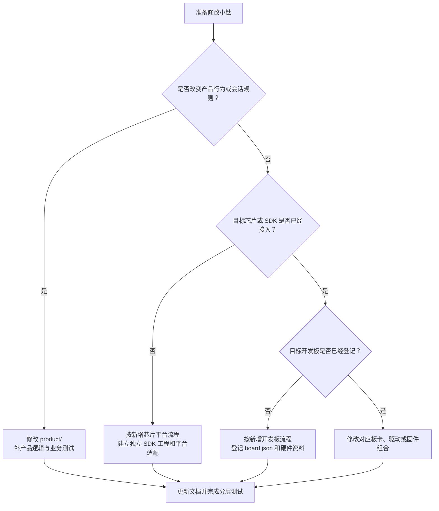

# 参与小钛开发

[快速体验](README.md) · [架构与二次开发](ARCHITECTURE.md) · [参与开发](CONTRIBUTING.md) · [完整文档](docs/README.md)

欢迎修复问题、补充测试、适配开发板或接入新的芯片平台。开始修改前，请先确认变更属于产品、平台、板卡还是固件组合层，避免把可复用逻辑写进某一块板的工程。

## 准备环境

1. 阅读[架构与二次开发](ARCHITECTURE.md)，了解目录边界和媒体生命周期。
2. 从[开发板目录](docs/boards/README.md)打开目标板手册，安装其中锁定的 SDK 和编译器。
3. 运行 `python3 tools/build.py --list-boards`，确认目标板卡 ID（开发板在本仓库中的唯一名称）。
4. 运行 `python3 tools/build.py --board <board-id> --dry-run`，核对实际工程和原生命令。

ESP-IDF 与 Beken 使用各自的 SDK 工程和工具链。不要为了统一命令而合并它们的构建文件，也不要提交本机工具链、构建目录、设备密钥或无线网络凭证。

使用 `python3 tools/build.py --board <board-id>` 编译固件。每次实际构建前，
目标板卡的 `+build.n` 自动加 1，并同步更新版本上报；`--release` 只选择发布配置，
不额外递增一次。失败的构建保留已分配的编号，重试使用下一个编号。
`--dry-run`、板卡列表和清单校验不改变版本。直接调用 SDK 原生命令不会分配新编号，
需要区分烧录版本时应使用统一入口。

## 选择正确的开发方式

先按下图判断改动应该落在哪一层，再阅读对应的详细流程。



修改已经支持的开发板时，直接进入它的板卡指南和固件工程。产品业务优先在 `product/` 修改；平台公共能力进入 `platforms/`；GPIO（通用输入输出引脚）、总线、时钟和电源时序留在板级代码。

为已有芯片增加板型时，按下文的[新增开发板](#新增开发板)流程操作。必须创建
`boards/<vendor>/<board>/board.json`，并提供对应的板卡文档、硬件资料来源和验证计划。

接入新芯片或新 SDK（软件开发工具包）时，按下文的[新增芯片平台](#新增芯片平台)
流程操作。新平台先建立独立、可原生编译的固件工程，再通过稳定 C 接口接入产品层。

## 新增开发板

这个流程适用于仓库已经支持对应芯片和 SDK、但还没有支持当前准确型号或 PCB
（印刷电路板）版本的情况。

开始前要准备完整销售型号、PCB 版本、正反面照片、原理图、关键器件、引脚和电源时序，
还要明确 Flash、PSRAM、分区、烧录工具、SDK、TiRTC SDK 和目标产品能力。缺失事实写为
`unknown`，再通过器件 ID、探针或实板测量确认，不能从同芯片或外观相似的开发板猜测。

1. 新建 `boards/<vendor>/<board>/board.json`，分配永久且唯一的板卡 ID。
2. 建立 Hardware IR（硬件信息记录）或探针报告，为硬件事实保留来源和证据等级。
3. 实现板级适配；GPIO、总线、DMA、时钟和电源时序不能进入产品业务层。
4. 新增可独立阅读的板卡指南，写清规格、依赖、编译、烧录、首次使用、测试和排查。
5. 运行清单校验、主机测试和目标固件完整构建，再执行实板 HIL（硬件在环测试）。
6. 发布包记录板卡 ID、PCB 版本、源码提交、SDK/TiRTC 版本和 SHA-256（文件校验值）。

## 新增芯片平台

新芯片不是复制最接近的固件工程并修改 target（构建目标）。应先建立新的平台边界：

1. 固定 SDK、工具链、链接脚本、启动方式、分区和 TiRTC ABI（应用二进制接口）版本。
2. 建立 `platforms/<sdk>/`，实现任务、时间、网络、存储、媒体和日志边界。
3. 建立独立、可由厂商工具原生构建的 `firmware/<sdk>/...` 工程。
4. 用最小工程先验证启动、串口、内存和网络，再接入产品层和第一块开发板。
5. 接入设备能力上报、逻辑流编号、编解码和会话仲裁，并增加主机契约测试。
6. 将平台加入板卡清单校验和构建矩阵，完成完整构建、崩溃符号化、弱网和实板验证。

平台至少在两块同芯片开发板上复用后，再提取板间公共驱动，避免第一块板阶段形成错误抽象。

## 手工开发与 AI 协作

手工开发时，按“资料核对 → 最小探针 → 板级适配 → 平台媒体 → 产品业务 → 完整构建 →
实板验证”的顺序推进。媒体问题先记录方向、流编号、编码、采样率、帧数、SDK 返回码和
会话代次，不用扩大任务栈或无限重试掩盖生命周期错误。

使用 AI 协作时，应提供仓库路径、板卡 ID、原理图或 BSP（板级支持包）、SDK 与 TiRTC
版本、目标功能、当前日志、串口与烧录权限，以及不能改动的分区和数据。AI 的交付必须
区分“代码检查通过”“完整构建通过”和“实板验证通过”；资料不足时列出待确认项，不猜测。

仓库根目录的 `AGENTS.md` 是 AI 开发工具的操作约束。修改板卡结构、交互流程或房间分配逻辑前，还要读取其中指定的架构与产品文档。

## 产品与媒体变更

开始修改前，核对[二次开发易错点与回归入口](docs/development/pitfalls.md)，
特别留意 UI 操作编号隔离、顶层提示布局、AI 音频突发队列和退出排空条件。

界面、按键、语音控制或用户流程发生变化时，先阅读[产品交互配置](docs/product/PRODUCT_INTERACTION_PROFILES.md)和 `product/interaction/README.md`。交互适配器产生意图，产品运行时持有业务状态。

音频格式、视频分辨率、帧率、码率、stream ID（媒体流编号）或 AEC（声学回声消除）路径变化时，必须同步更新[音视频参数](docs/product/MEDIA_CONTRACT.md)、设备能力上报和相应测试。

修改房间分配触发方式时，遵守[产品交互规范中的房间分配规则](docs/product/PRODUCT_INTERACTION_PROFILES.md#64-房间分配刷新)。MQTT（消息队列遥测传输）通知和明确的用户入口是仅有的刷新意图。

## 测试要求

功能修改采用测试驱动开发：先添加一个能复现目标行为或故障的测试，确认修改前失败，
再完成实现并运行全量检查。产品业务优先测试 `product/include/` 中的公开接口；平台
内部测试用于补足驱动、并发退出、SDK 回调和条件编译，不能替代业务接口测试。详细
分层、覆盖率门槛和实板验收矩阵见[测试说明](tests/README.md)。

修改板卡、项目布局或构建分发后，至少执行：

```bash
python3 tools/build.py --validate
python3 -m unittest discover -s tools/tests -v
```

提交前建议运行完整仓库检查：

```bash
bash tools/check.sh
```

涉及具体固件时，还要运行对应 SDK 的完整构建。涉及驱动、音视频或产品业务时，应完成实板 HIL（硬件在环测试），并记录固件身份、板卡版本、测试方向和结果。

测试报告的本地自动化输出放在 `tests/.local/`，该目录不会提交。长期有效的测试规则进入 `tests/` 或 `tools/tests/`；对外文档只写当前能力和可复现步骤，不保存阶段性聊天记录。

## 文档要求

每块正式支持的开发板必须有独立使用指南，依次说明烧录、首次使用、规格、音视频参数、
环境与依赖、原理图资料、开发目录、编译、测试、排查、验证状态和已知限制。首次使用要
写明由谁使用手机或电脑、何时进入配网或绑定、在哪里输入信息、成功现象及失败恢复方式。

板卡 ID 与构建入口以 `board.json` 为准；GPIO、总线和器件事实以 Hardware IR 或探针
报告为准；公开资料只链接官方来源。本机下载的 SDK、原理图和厂商示例放在被忽略的
`.tools/` 或 `.references/`，不能成为未说明的源码依赖。

对外文档只描述当前项目怎样使用和开发，不记录已经结束的迁移或故障过程。任何层级
的 `.local/` 目录都只用于本机文件，不能提交。

中文文档应使用自然、直接的表达。一个段落只说明一个主题；不可避免的英文缩写在首次出现时用括号解释。中文版确认无误后，再同步生成英文版，两个版本应保留相同结构和事实来源。

## 提交前检查

- 行为变更或修复缺陷已经添加回归测试，并确认测试在修改前失败、修改后通过；
- 未新增测试的改动已经说明原因，以及覆盖该改动的现有测试；
- 构建只选择一块板和一个明确变体；
- 板卡清单没有被当成硬件证明；
- 没有提交构建产物、工具链、密钥、无线网络配置或本地报告；
- 静态测试、单元测试和相关固件构建已经通过；
- 实板结论说明了板卡、固件和测试范围；
- 文档、设备能力上报与代码参数一致；
- 第三方 SDK、库、模型、字体和媒体资源符合其许可证。

本项目自有源码和文档采用 [MIT License](LICENSE)。第三方内容仍按[第三方清单](THIRD_PARTY.md)及其原始许可处理。
