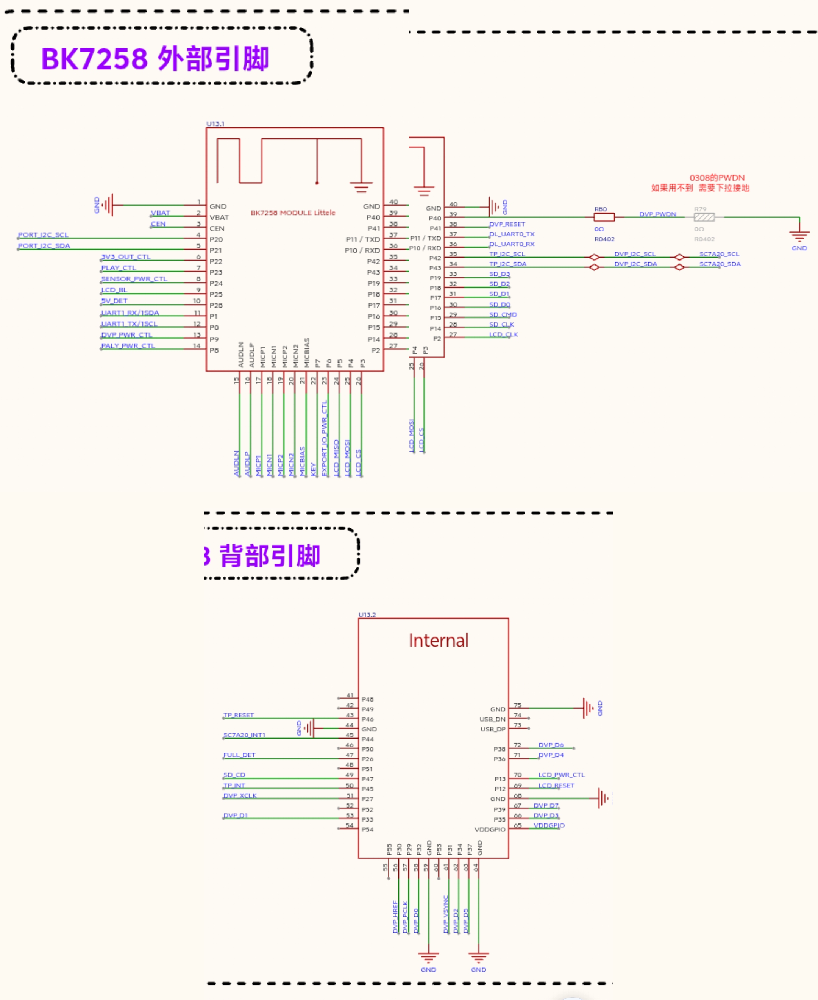

# BK7258 carrier-board schematic reference

The archived image below is a pixel-preserving contact sheet made from the three
supplied schematic screenshots. It crops only the phone/browser chrome and does
not redraw circuit text, nets or symbols. The first two panels are the left and
right fragments of U13.1; the lower panel is U13.2.

SHA-256: `2abda4fa4a12d0ee3c462b32abb0e5c9afa0deadb839f8bdbcd1f5300dae892d`

## Product pin map extracted from the schematic

| Function | BK7258 GPIO | Schematic net | Firmware behavior |
| --- | ---: | --- | --- |
| Camera rail control | P9 | `DVP_PWR_CTL` | High before DVP open; low after close/failure |
| Camera power-down | P40 | `DVP_PWDN` | SDK reset sequence ends low (active camera) |
| Camera reset | P41 | `DVP_RESET` | SDK reset sequence ends high (released) |
| Camera SCCB clock | P42 | `DVP_I2C_SCL` | Simulated I2C bus 2, 100 kHz |
| Camera SCCB data | P43 | `DVP_I2C_SDA` | Simulated I2C bus 2 |
| Camera master clock | P27 | `DVP_XCLK` | 24 MHz |
| Camera parallel bus | P29-P39 | PCLK/HREF/VSYNC/D0-D7 | Official BK7258 DVP pin group |
| Amplifier power | P8 | `PALY_PWR_CTL` | High while board audio is active |
| Amplifier playback | P23 | `PLAY_CTL` | Active low while playing; high while muted |

The source annotation on `DVP_PWDN` says the GC0308 PWDN signal must be pulled
down when unused. R80 is fitted as 0 ohm; R79 is the optional 0-ohm path to
ground shown in the screenshot. Firmware therefore explicitly provides P40 and
drives the sensor to its active low state instead of relying on R79 population.

This reference establishes board routing, not the fitted camera sensor model.
Runtime probing detected a GC0308-compatible sensor at address `0x21`, ID
`0x9b`. TODO: retain the probe log with the next release-candidate hardware
report; this evidence follow-up does not block source submission.
